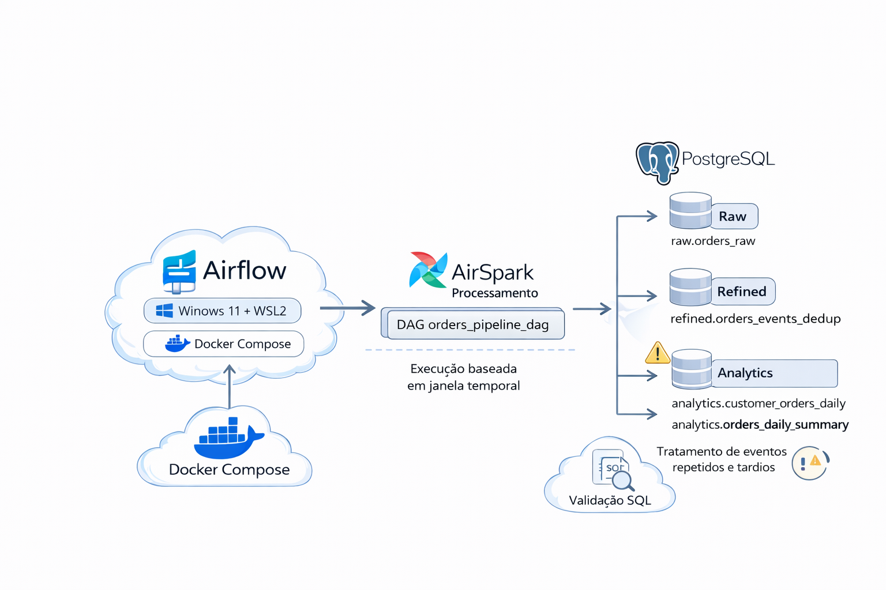
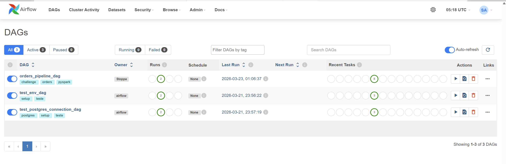
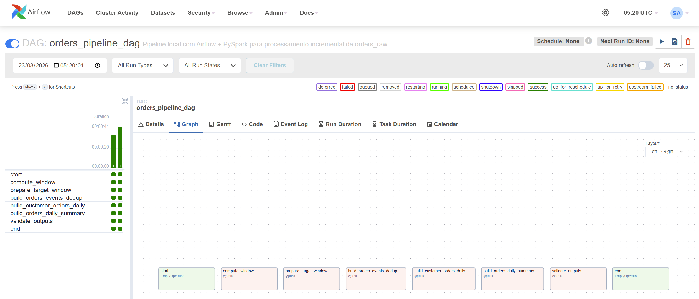
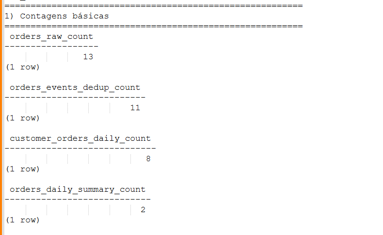

# Desafio Arquiteto de Dados - Pipeline de Pedidos com Airflow e PySpark

## Visão geral

Este projeto implementa uma solução local de engenharia de dados para processamento de eventos de pedidos, utilizando **Apache Airflow** para orquestração, **PySpark** para transformação e **PostgreSQL** para persistência das camadas de dados.

A solução foi construída para atender ao desafio técnico proposto, cobrindo os seguintes pontos centrais:

- ingestão de dados brutos em tabela raw;
- processamento orientado por janela temporal;
- tratamento de dados tardios;
- deduplicação de eventos;
- consolidação do estado mais recente dos pedidos;
- geração de tabelas analíticas;
- execução local de ponta a ponta com Docker Compose;
- validação das cargas após a execução da pipeline.

O projeto foi desenvolvido para execução local em ambiente Windows + WSL2 + Docker, com foco em clareza de arquitetura, reprodutibilidade e justificativa técnica das decisões adotadas.

---

## Objetivo

Construir um pipeline local capaz de:

- carregar dados brutos de pedidos na camada **raw**;
- processar uma janela temporal com base em `business_date`;
- tratar duplicidades de eventos;
- consolidar o estado mais recente dos pedidos;
- gerar tabelas analíticas para consulta;
- permitir validação dos resultados após a execução da DAG principal.

---

## Arquitetura da solução

A solução foi organizada em três camadas principais:

### 1. Raw
Armazena os eventos brutos de pedidos exatamente como ingeridos.

### 2. Refined
Aplica padronização, deduplicação e preparação intermediária dos dados.

### 3. Analytics
Disponibiliza as visões analíticas finais para consumo.

### Componentes utilizados

- **Apache Airflow**: orquestração do pipeline
- **PySpark**: transformação e processamento dos dados
- **PostgreSQL**: persistência das tabelas
- **Docker Compose**: execução local dos serviços
- **WSL2 + Ubuntu**: ambiente de desenvolvimento local

### Fluxo resumido

1. Criação da tabela `raw.orders_raw`
2. Carga inicial dos eventos brutos em `raw.orders_raw`
3. Criação das tabelas-alvo das camadas `refined` e `analytics`
4. Execução da DAG principal `orders_pipeline_dag`
5. Leitura da janela temporal pela pipeline
6. Deduplicação dos eventos
7. Consolidação do estado mais recente dos pedidos
8. Geração das tabelas analíticas
9. Validação da carga com queries SQL

### Diagrama da arquitetura



---

## Estrutura do repositório

```text
.
├── dags/
│   ├── __pycache__/
│   ├── orders_pipeline_dag.py
│   ├── test_env_dag.py
│   └── test_postgres_connection_dag.py
├── docs/
│   └── architecture_notes_v0.1.md
├── logs/
│   ├── dag_id=orders_pipeline_dag/
│   ├── dag_id=test_env_dag/
│   ├── dag_id=test_postgres_connection_dag/
│   ├── dag_processor_manager/
│   └── scheduler/
├── plugins/
├── sql/
│   ├── create_orders_raw.sql
│   ├── create_target_tables.sql
│   ├── insert_orders_raw.sql
│   └── load_process_validation_queries.sql
├── src/
├── .env
├── docker-compose.yml
├── Dockerfile
├── README.md
└── requirements.txt
```

### Descrição das principais pastas e arquivos

#### `dags/`
Contém as DAGs do Airflow:

- `orders_pipeline_dag.py`: DAG principal do pipeline
- `test_env_dag.py`: DAG de teste do ambiente
- `test_postgres_connection_dag.py`: DAG de teste de conexão com PostgreSQL

#### `docs/`
Contém documentação complementar da solução, como notas de arquitetura.

#### `logs/`
Contém logs gerados pelo Airflow durante a execução local.

#### `plugins/`
Pasta reservada para plugins do Airflow, se necessário.

#### `sql/`
Contém os scripts SQL utilizados no projeto:

- `create_orders_raw.sql`: criação da tabela raw
- `insert_orders_raw.sql`: carga inicial dos dados brutos
- `create_target_tables.sql`: criação das tabelas-alvo das camadas refined e analytics
- `load_process_validation_queries.sql`: queries de validação das cargas após o processamento

#### `src/`
Contém o código-fonte da pipeline em Python/PySpark.

#### `docker-compose.yml`
Orquestra os containers necessários para o ambiente local.

#### `Dockerfile`
Define a imagem utilizada pelos serviços do projeto.

#### `.env`
Arquivo de variáveis de ambiente locais, incluindo o UID utilizado pelo Airflow.

#### `requirements.txt`
Dependências Python utilizadas pelo projeto.

---

## DAGs do projeto

O projeto possui três DAGs:

### `orders_pipeline_dag`
DAG principal responsável pelo processamento dos dados de pedidos.

### `test_env_dag`
DAG auxiliar para validação do ambiente de execução.

### `test_postgres_connection_dag`
DAG auxiliar para validação da conectividade com o PostgreSQL.

As duas DAGs de teste apoiam o diagnóstico do ambiente, mas a DAG principal da solução é a **`orders_pipeline_dag`**.

---

## Tecnologias utilizadas

- Python
- PySpark
- Apache Airflow
- PostgreSQL
- Docker Compose
- Ubuntu WSL2
- VS Code

---

## Pré-requisitos

Antes de executar o projeto, garanta que o ambiente abaixo esteja disponível.

### Sistema operacional esperado

Este projeto foi preparado para execução em **Windows com WSL2** e distribuição **Ubuntu**.

### Softwares necessários

- **Git**
- **WSL2**
- **Ubuntu no WSL2**
- **Docker Desktop**
- **Docker Compose**
- **VS Code** (opcional)

### Portas utilizadas

- `8080`: interface web do Airflow
- `5432`: PostgreSQL

### Validação rápida do ambiente

No terminal Ubuntu WSL, valide se os comandos abaixo funcionam corretamente:

```bash
git --version
docker --version
docker compose version
uname -a
```

Se algum desses comandos falhar, conclua a instalação ou configuração correspondente antes de seguir.

---

## Preparação do ambiente

Esta seção descreve a configuração mínima necessária para que o projeto possa ser executado localmente.

### 1. Instalar e configurar o WSL2

Caso esteja utilizando Windows, habilite o **WSL2** e instale uma distribuição **Ubuntu**.

Para verificar se o WSL está habilitado, abra uma sessão do Powershell como administrador e tente esse comando:

```bash
wsl --version
```
git status
Após a instalação, reinicie o computador e após a reinicialização, abra o terminal Ubuntu e confirme se o ambiente está funcional.

Validação recomendada:

```bash
uname -a
```

### 2. Instalar o Docker Desktop e habilitar integração com o WSL

Instale o **Docker Desktop** e habilite sua integração com a distribuição Ubuntu no WSL.

Depois disso, valide no terminal Ubuntu:

```bash
docker --version
docker compose version
docker ps
```

Se `docker ps` retornar erro de daemon indisponível ou erro de permissão, a integração do Docker com o WSL ainda não está configurada corretamente.

### 3. Instalar o Git

Valide se o Git está disponível no terminal Ubuntu:

```bash
git --version
```

### 4. Obter o UID do usuário no Ubuntu WSL

Este projeto utiliza a variável `AIRFLOW_UID`, que deve corresponder ao identificador do usuário no Ubuntu WSL.

Para obter esse valor, execute:

```bash
id -u
```

Guarde o valor retornado, pois ele será utilizado na configuração do arquivo `.env`.

### 5. Observação sobre instalação

Para manter este README objetivo, as instruções detalhadas de instalação de WSL2, Ubuntu e Docker não foram reproduzidas aqui. Recomenda-se seguir a documentação oficial de cada ferramenta para instalação e configuração inicial.

---

## Como executar o projeto

### 1. Clonar o repositório

```bash
git clone https://github.com/lucianostoppalsp/desafio_arquiteto_dados.git
cd desafio-arquiteto-dados
```

### 2. Configurar variáveis de ambiente

Criar ou ajustar o arquivo `.env` na raiz do projeto. Preencher o valor numérico com o que foi obtido pelo comando id -u executado no item "4. Obter o UID do usuário no Ubuntu WSL" da seção de preparação de ambiente

Exemplo:

```env
AIRFLOW_UID=1000
```

> O valor de `AIRFLOW_UID` deve corresponder ao resultado do comando `id -u` executado no Ubuntu WSL.

### 3. Subir o ambiente

```bash
docker compose up -d --build
```

### 4. Verificar se os containers estão ativos

```bash
docker compose ps
```

### 5. Criar o database

```bash
docker compose exec postgres psql -U airflow -d postgres -c "CREATE DATABASE challenge_db;"
```

> Se o banco da sua instalação não for `challenge_db`, substitua pelo nome correto do banco onde os schemas `raw`, `refined` e `analytics` foram criados.

### 6. Criar a tabela raw

```bash
docker compose exec -T postgres psql -U airflow -d challenge_db < sql/create_orders_raw.sql
```

### 7. Criar as tabelas-alvo

```bash
docker compose exec -T postgres psql -U airflow -d challenge_db < sql/create_target_tables.sql
```

### 8. Carregar os dados na raw

```bash
docker compose exec -T postgres psql -U airflow -d challenge_db < sql/insert_orders_raw.sql
```

> Validar a carga: 

```bash
docker compose exec postgres psql -U airflow -d challenge_db -c "SELECT COUNT(*) FROM raw.orders_raw;"
docker compose exec postgres psql -U airflow -d challenge_db -c "SELECT * FROM raw.orders_raw;"
```

### 9. Acessar a interface do Airflow

Abrir no navegador:

```text
http://localhost:8080
```

### 10. Credenciais padrão

- **usuário**: `admin`
- **senha**: `admin`

### 11. Executar DAGs de teste, se necessário

Antes da execução da DAG principal, também é possível validar o ambiente executando:

- `test_env_dag`
- `test_postgres_connection_dag`


### 12. Executar a DAG principal

Após acessar o Airflow:

1. localizar a DAG `orders_pipeline_dag`;
2. habilitar a DAG;
3. executar manualmente a pipeline;
4. acompanhar os logs das tasks.

> Validar a carga das tabelas das camadas refined e analytics: 

```bash
docker compose exec postgres psql -U airflow -d challenge_db -c "SELECT COUNT(*) AS dedup_count FROM refined.orders_events_dedup WHERE business_date BETWEEN DATE '2026-03-13' AND DATE '2026-03-20';"
docker compose exec postgres psql -U airflow -d challenge_db -c "SELECT COUNT(*) AS customer_daily_count FROM analytics.customer_orders_daily WHERE business_date BETWEEN DATE '2026-03-13' AND DATE '2026-03-20';"
docker compose exec postgres psql -U airflow -d challenge_db -c "SELECT COUNT(*) AS daily_summary_count FROM analytics.orders_daily_summary WHERE business_date BETWEEN DATE '2026-03-13' AND DATE '2026-03-20';"
```

> Para uma validação mais completa executar esse sql: 

```bash
docker compose exec -T postgres psql -U airflow -d challenge_db < sql/load_process_validation_queries.sql
```

---

## Estratégia temporal

A pipeline processa os dados com base no campo `business_date`.

Foi adotada uma estratégia de reprocessamento controlada por uma janela temporal definida por:

- `reference_date`
- `lookback_days`

A partir desses parâmetros, a janela processada é calculada da seguinte forma:

- `start_date = reference_date - lookback_days`
- `end_date = reference_date`

Essa abordagem permite reprocessar um período recente da base, acomodando eventos tardios sem a necessidade de reprocessar toda a massa histórica.

### Motivação

Em cenários reais, eventos podem chegar com atraso em relação à sua data de negócio. O uso de uma janela de lookback reduz o risco de perda desses eventos e mantém a consistência das tabelas analíticas.

---

## Estratégia de deduplicação

A deduplicação foi tratada em duas perspectivas.

### 1. Deduplicação de eventos exatos na camada refined

Na camada `refined`, duplicidades exatas são removidas com base na chave lógica:

- `order_id`
- `customer_id`
- `status`
- `amount`
- `business_date`

### 2. Seleção do estado mais recente do pedido para as tabelas analíticas

Para as tabelas analíticas, a lógica considera que um mesmo pedido pode ter múltiplos estados ao longo do tempo. Nesses casos, é selecionado o estado mais recente de cada pedido com base em:

- `ingested_at` em ordem decrescente;
- `event_id` em ordem decrescente como critério de desempate.

Essa abordagem preserva a integridade histórica dos eventos intermediários na camada refined, ao mesmo tempo em que fornece uma visão consolidada do estado mais recente para consumo analítico.

---

## Idempotência e reprocessamento

A solução foi desenhada para permitir reexecução da janela temporal sem gerar inconsistências nas tabelas finais.

O pipeline reprocessa a janela selecionada e reconstrói logicamente os resultados esperados para esse intervalo, garantindo previsibilidade e consistência mesmo em casos de nova execução.

Esse comportamento é especialmente importante para tratar:

- dados tardios;
- reexecuções operacionais;
- ajustes corretivos no pipeline.

---

## Tabelas geradas

### Camada raw

- `raw.orders_raw`: tabela com os eventos brutos de pedidos

### Camada refined

- tabela de eventos deduplicados e preparados para consolidação analítica

### Camada analytics

- tabela analítica diária por cliente
- tabela analítica diária consolidada

> Os nomes exatos das tabelas de saída podem ser detalhados aqui conforme definidos no script `create_target_tables.sql` e na implementação da pipeline.

Se desejar, você pode substituir esta seção pelos nomes exatos das tabelas finais, por exemplo:

```md
### Camada refined
- `refined.orders_events_dedup`

### Camada analytics
- `analytics.customer_orders_daily`
- `analytics.orders_daily_summary`
```

---

## Validação da execução

Após a execução da DAG principal, as cargas podem ser validadas por meio do script:

- `sql/load_process_validation_queries.sql`

Essas validações verificam, entre outros pontos:

- contagem de registros nas camadas;
- efeito da deduplicação;
- consistência das agregações;
- ausência de duplicidades indevidas;
- conformidade dos dados gerados após a execução do pipeline.

### Executar validações

```bash
docker compose exec -T postgres psql -U airflow -d challenge_db < sql/load_process_validation_queries.sql
```

As queries de validação foram parametrizadas para utilizar variáveis de janela temporal, evitando o uso de datas hardcoded e facilitando o reuso do script.

---


## Evidências da solução

## Evidências visuais

### DAG principal no Airflow


### Execução com sucesso

Servem como evidências complementares da execução do pipeline os seguintes vídeos enviados por email: 
- evidencia_execucao_pipeline.mp4 
- evidencia_logs_execucao_pipeline.mp4

### Resultado das validações


Serve como evidência complementar da validação da execução do pipeline o seguintes vídeo enviado por email: 
- evidencia_execucao_validacao_carga_tabelas_pipeline.mp4 

---

## Decisões técnicas e trade-offs

Para priorizar clareza, reprodutibilidade e simplicidade de avaliação local, foram adotadas as seguintes decisões:

- uso de **PostgreSQL local** como persistência das tabelas;
- execução local via **Docker Compose**;
- uso de **Airflow** como orquestrador do fluxo;
- uso de **PySpark** como motor de transformação;
- organização dos dados em camadas `raw`, `refined` e `analytics`;
- manutenção de scripts SQL explícitos para criação, carga e validação.

### Principais trade-offs

- a solução foi otimizada para execução local, e não para escala massiva;
- não foi utilizado cluster Spark distribuído;
- a carga inicial da raw é manual e controlada por script SQL;
- a observabilidade é baseada principalmente em logs e queries de validação;
- o ambiente foi simplificado para facilitar demonstração, avaliação e reprodutibilidade.

Esses trade-offs são adequados ao contexto do desafio, em que o foco principal está na modelagem da solução, na lógica do pipeline e na capacidade de justificar tecnicamente as decisões adotadas.

---

## Como a solução evoluiria para produção

Em um ambiente produtivo, a arquitetura poderia evoluir nos seguintes pontos.

### Armazenamento
- adoção de Data Lake ou Lakehouse;
- particionamento físico por data;
- versionamento e governança dos dados.

### Processamento
- execução do Spark em cluster;
- aumento de paralelismo e escalabilidade;
- tuning de performance e particionamento.

### Orquestração
- Airflow gerenciado;
- conexões e variáveis armazenadas em cofre de segredos;
- alertas e políticas de retry mais robustas.

### Qualidade e governança
- testes automatizados de dados;
- validações integradas ao pipeline;
- monitoramento de SLA;
- rastreabilidade operacional.

### Entrega contínua
- CI/CD para DAGs, jobs PySpark e scripts SQL;
- padronização de ambientes;
- versionamento de artefatos de deploy.

---

## Limitações da versão atual

- ambiente focado em execução local;
- carga inicial da raw realizada manualmente;
- observabilidade simplificada;
- ausência de suíte completa de testes automatizados;
- volume de dados reduzido em relação a cenários reais de produção.

---

## Possíveis melhorias

Como próximos passos, a solução pode ser fortalecida com:

- testes unitários para transformações PySpark;
- testes de integração do pipeline;
- parametrização da execução via `dag_run.conf` ou Airflow Variables;
- automação da carga inicial da camada raw;
- documentação mais detalhada da modelagem das tabelas finais;
- inclusão de métricas operacionais por execução;
- melhoria da estratégia de monitoramento e diagnóstico.

---

## Execução rápida do dia a dia

Depois que o ambiente já foi montado uma vez, o fluxo normal para restaurar o projeto após reiniciar a máquina é:

```bash
cd /home/projetos/desafio-arquiteto-dados
docker compose up -d
docker compose ps
```

Depois disso, basta acessar:

```text
http://localhost:8080
```

---

## Autor

Projeto desenvolvido por **Stoppa** para o desafio técnico de **Arquiteto de Dados**.
